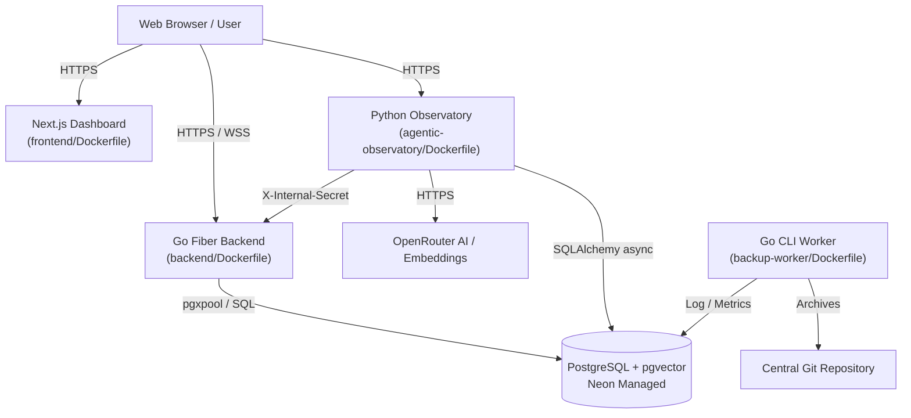

# GitHub Backup Observatory & Management System

[](LICENSE)
[](https://go.dev/)
[](https://python.org/)
[](https://nextjs.org/)
[](https://docker.com/)

A distributed backup automation and AI-driven telemetry observatory. The system automates repository archiving, stores historical analytics in PostgreSQL, provides live WebSocket streaming, performs hybrid search using pgvector and full-text search, and hosts an AI Agentic Observatory for automated incident analysis and report generation.

**All four services are Docker-first**: each ships as a Docker image and the entire stack runs locally with a single `docker compose up`.

---

## Live Resources

- **Production Dashboard**: [github.mishrashardendu22.is-a.dev](https://github.mishrashardendu22.is-a.dev)
- **API Documentation**: [docs/API_REFERENCE.md](docs/API_REFERENCE.md)
- **Architecture Guide**: [docs/ARCHITECTURE.md](docs/ARCHITECTURE.md)
- **Branching Policy**: [BRANCHING.md](BRANCHING.md)
- **Repository Workflow**: [WORKFLOW.md](WORKFLOW.md)
- **Pre-Commit Gate**: [docs/PRECOMMIT_WORKFLOW.md](docs/PRECOMMIT_WORKFLOW.md)
- **Video Walkthrough**: [YouTube Demonstration](https://www.youtube.com/watch?v=be0UBwk2asc)

---

## Architecture & Deployment Model

The system is organized into four Docker containers sharing a managed Neon PostgreSQL database:



### Components

| Service | Technology | Deployment | Description |
| :--- | :--- | :--- | :--- |
| **Frontend** | Next.js 16, React 19, Tailwind CSS | Docker → **Vercel** | Interactive dashboard with real-time WebSocket feeds, analytics charts, and AI chat playground. |
| **Observatory** | FastAPI, Python 3.14, SQLAlchemy, LangChain | Docker → **Render** | AI telemetry service with OpenRouter LLM integration, hybrid vector + full-text search, and automated reports. |
| **Backend API** | Go 1.24, Fiber v2, pgxpool | Docker → **Render** | High-performance REST and WebSocket API with connection pooling, structured logging (`slog`), and versioned SQL migrations. |
| **Worker Engine** | Go 1.24 CLI (`backup-worker/`) | Docker → **Local / Cron** | Autonomous CLI backup engine with incremental SHA-HEAD verification, concurrency controls, and `.tar.gz` archiving. |
| **Database** | PostgreSQL 16 + `pgvector` | **Neon (Cloud Managed)** | Persistent relational storage for backup runs, execution logs, analytics snapshots, and embedding vectors. |

---

## 🐳 Docker Development Workflow (Recommended)

The primary development and deployment workflow uses Docker Compose.

### Prerequisites

- [Docker Desktop](https://docs.docker.com/get-docker/) or Docker Engine + Compose plugin
- Copy and populate `.env` files for each service (see [Configuration Reference](#configuration-reference) below)

### Quick Start

```bash
# 1. Clone the repository
git clone <repo-url> && cd github-backup-automation-system

# 2. Populate environment files (see Configuration Reference below)
cp backend/.env.example backend/.env         # fill in secrets
cp agentic-observatory/.env.example agentic-observatory/.env
cp frontend/.env.example frontend/.env.local

# 3. Start all three web services
make docker-up
# or: docker compose up --build -d

# 4. Open the dashboard
open http://localhost:3000

# 5. Tail logs
make docker-logs

# 6. Stop all services
make docker-down
```

### Run the Backup Worker

```bash
# Run one backup cycle (one-shot CLI, exits when done)
make docker-backup
# or: docker compose run --rm backup-worker
```

### Default Port Mappings (Docker)

| Service | URL |
|---|---|
| **Frontend Dashboard** | `http://localhost:3000` |
| **Go REST API & Metrics** | `http://localhost:8080` |
| **Python Observatory** | `http://localhost:8000` |

### Docker Make Targets

| Target | Description |
|---|---|
| `make docker-up` | Build images and start all web services |
| `make docker-down` | Stop and remove all containers |
| `make docker-build` | Build (or rebuild) all Docker images |
| `make docker-logs` | Tail live logs from all containers |
| `make docker-backup` | Run the backup worker container (one-shot) |
| `make docker-shell-backend` | Open a shell in the backend container |
| `make docker-shell-observatory` | Open a shell in the observatory container |
| `make docker-clean` | Remove all project containers, images, and volumes |

---

## Native Development Workflow (Alternative)

If you prefer to run services natively (without Docker), all original `make` targets are preserved:

```bash
# Start Go (8080), Python (8000), and Frontend (3000) natively
make dev

# Run the autonomous Backup Worker CLI natively
make backup

# Run all test suites
make test

# Run full pre-commit validation gate
make pre-commit
```

> **Prerequisites for native dev**: Go 1.24+, Python 3.14+ with `uv`, Node.js 20+ with `pnpm`, `air` for Go hot-reload.

---

## Deployment & Service Configuration

### 1. Go Backend (Render — Docker)
- **Service Type**: Docker web service on Render
- **Dockerfile**: `backend/Dockerfile` (build context: repo root)
- **Environment Variables**:
  - `DATABASE_URL`: PostgreSQL connection string (`postgresql://...`)
  - `INTERNAL_SECRET`: Shared secret for protected endpoints
  - `SERVER_PORT`: Port (defaults to `8080`)

### 2. Python Observatory (Render — Docker)
- **Service Type**: Docker web service on Render
- **Dockerfile**: `agentic-observatory/Dockerfile`
- **Environment Variables**:
  - `GO_BACKEND_URL`: URL to your Go Backend
  - `DATABASE_URL`: PostgreSQL async connection string (`postgresql+asyncpg://...`)
  - `INTERNAL_SECRET`: Shared secret matching Go Backend
  - `OPENROUTER_API_KEY`: OpenRouter API key for LLM and embeddings
  - `JWT_SECRET`: Secret key for JWT session tokens
  - `CHAT_USERNAME` / `CHAT_PASSWORD`: Admin credentials for chat authentication

### 3. Frontend (Vercel — Docker or Native)
- **Vercel native**: Root directory `frontend/`, build command `pnpm run build`
- **Docker**: `frontend/Dockerfile` (3-stage standalone build)
- **Environment Variables**:
  - `NEXT_PUBLIC_API_URL`: Your Render Go backend public URL
  - `NEXT_PUBLIC_AGENT_URL`: Your Render/Vercel Python observatory URL

### 4. Autonomous Backup Worker (Local / Cron — Docker)
- **Dockerfile**: `backup-worker/Dockerfile` (build context: repo root)
- **Run**: `make docker-backup` or `docker compose run --rm backup-worker`
- **Required Volume Mounts**:
  - `./backup-worker/_Repos:/app/_Repos` — cloned repository storage
  - `./backup-worker/app.db:/app/app.db` — SQLite incremental state
  - `~/.ssh:/root/.ssh:ro` — SSH keys for GitHub operations
- **Environment Variables**:
  - `GITHUB_TOKEN_PERSONAL`: Personal access token for public & user repo discovery
  - `GITHUB_TOKEN_PRIVATE`: Personal access token with `repo` scope for private repos
  - `PROJECT_ACCOUNT`: Target GitHub username
  - `ORG_ACCOUNT`: Target GitHub organization
  - `BACKUP_REPO_PATH`: Git SSH clone URL of target backup repository
  - `DATABASE_URL`: PostgreSQL connection string for real-time telemetry

---

## Database Migrations & Versioning

The Go backend features an embedded versioned migration runner (`backend/db/migrator.go`):

| Version | Migration File | Description |
| :--- | :--- | :--- |
| `000001` | `000001_initial_schema.up.sql` | Core tables (`backup_runs`, `backup_results`, `execution_logs`, `analytics_snapshots`, `backup_fixes`) |
| `000002` | `000002_embeddings_and_search.up.sql` | Extensions `vector` & `pg_trgm`, tables `embedding_generations`, `embedding_chunks`, `embedding_jobs` |
| `000003` | `000003_normalize_schema_and_metadata.up.sql` | Creates `ai_session_metadata`, enforces 1-to-1 run analytics index, cleans legacy empty strings to SQL `NULL` |
| `000004` | `000004_cleanup_stale_embeddings_and_errors.up.sql` | Cascading deletion of `RETIRED`/`FAILED` generations and stale jobs, cleans investigation errors |
| `000005` | `000005_deterministic_embedding_lifecycle.up.sql` | Partial indexes on errors/commits, chunk metadata normalization, blue-green promotion |

Migrations use non-destructive `CREATE TABLE IF NOT EXISTS` statements and preserve all existing historical data.

---

## Backup & Disaster Recovery

Automate database backups with SHA256 integrity checks:

```bash
# Run backup script (saves to backups/postgres/ with 14-day retention)
make backup-db

# Restore from a backup archive
make restore-db BACKUP_FILE=backups/postgres/gbm_pg_backup_YYYYMMDD_HHMMSS.sql.gz
```

---

## Configuration Reference (Secrets & Endpoints)

| Environment Variable | Service | Purpose | Type |
| :--- | :--- | :--- | :--- |
| `DATABASE_URL` | Backend, Observatory, Worker | PostgreSQL connection string | Secret |
| `INTERNAL_SECRET` | Backend, Observatory | Shared secret for internal API auth | Secret |
| `OPENROUTER_API_KEY` | Observatory | API key for OpenRouter AI | Secret |
| `JWT_SECRET` | Observatory | Secret key for JWT signing | Secret |
| `CHAT_USERNAME` / `CHAT_PASSWORD` | Observatory | Admin credentials for dashboard chat | Secret |
| `GO_BACKEND_URL` | Observatory | URL to deployed Go Backend API | Endpoint |
| `NEXT_PUBLIC_API_URL` | Frontend | URL to deployed Go Backend API | Endpoint |
| `NEXT_PUBLIC_AGENT_URL` | Frontend | URL to deployed Python Observatory | Endpoint |
| `SMTP_USERNAME` / `SMTP_PASSWORD` | Observatory | SMTP email credentials for report dispatch | Secret |
| `SMTP_FROM` / `SMTP_TO` | Observatory | Sender and recipient email addresses | Config |
| `GITHUB_TOKEN_PRIVATE` | Worker CLI | Token for private repo discovery/cloning | Secret |
| `GITHUB_TOKEN_PERSONAL` | Worker CLI | Token for GitHub API rate limits | Secret |

---

## Contributing & License

Contributions are welcome! Please review [CONTRIBUTING.md](CONTRIBUTING.md) before submitting pull requests.

Distributed under the MIT License. See `LICENSE` for more information.
