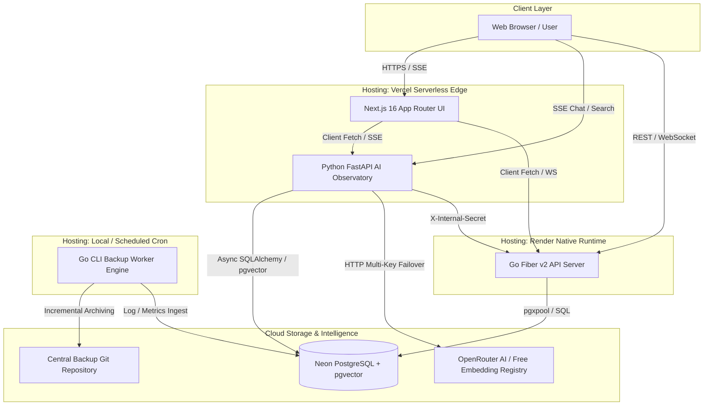
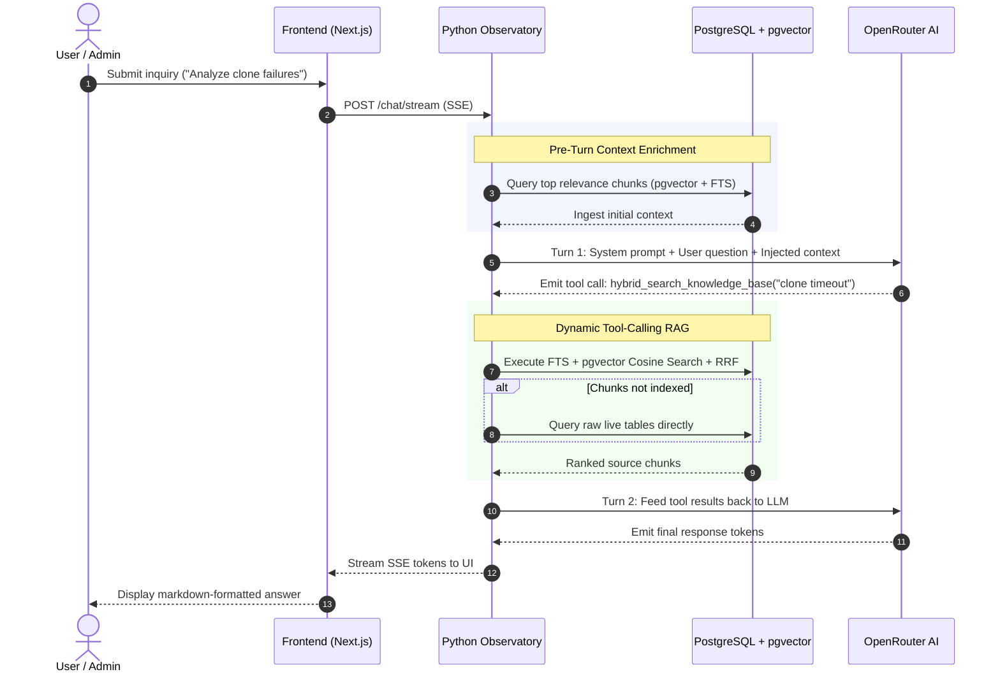

# System Architecture & Technical Specifications

This document outlines the distributed architecture, component boundaries, data flow, vector search pipeline, and deployment topology of the **GitHub Backup Automation & Observatory System**.

---

## 1. High-Level Architecture Topology

---

## 2. Core Service Components & Responsibilities

### Tier 1: Frontend Dashboard (Next.js 16 App Router)
* **Hosting**: **Vercel** (Turbopack, Serverless Functions).
* **Role**: Single-pane-of-glass operations console.
* **Key Features**:
  * **Real-time Live Logs**: WebSocket streaming from Go backend (`/ws/live`).
  * **Search Playground**: Live hybrid query testing with model selection, generation status badges, and score breakdowns.
  * **AI Chat & Investigation Console**: Multi-turn agentic chat with SSE token streaming, thinking visualization, and Human-in-the-Loop (HITL) approval modals.
  * **Analytics & Metrics**: Visual charts for repository sizes, run durations, success rates, and commit trends.

### Tier 2: AI Agentic Observatory (FastAPI + LangChain)
* **Hosting**: **Vercel** (Python Serverless Runtime).
* **Role**: Cognitive telemetry, vector embeddings, and autonomous incident investigation.
* **Key Features**:
  * **Tool-Calling RAG Pipeline**: Multi-turn agent with dynamic tool invocation (`hybrid_search_knowledge_base`, `fetch_backup_metrics`, `list_backup_runs`, `send_report_email`).
  * **Dynamic OpenRouter Model Registry**: Fetches 100% free embedding and reranking models dynamically with in-memory caching and fallback definitions.
  * **Multi-Key OpenRouter Failover**: Seamless rotation across comma-separated `OPENROUTER_API_KEY`s upon encountering `401`, `402`, or `429`.
  * **Vector Lifecycle Engine**: Blue-Green style index generation (`BUILDING` -> `READY` -> `ACTIVE` -> `RETIRED`) with automatic cascade deletion of stale generations.
  * **Human-In-The-Loop (HITL)**: Sensitive actions yield confirmation tokens (`confirm_id`) requiring user approval before execution.

### Tier 3: High-Performance Backend API (Go 1.24 + Fiber v2)
* **Hosting**: **Render** (Native Linux Web Service).
* **Role**: Central data ingest, monitoring REST API, and WebSocket distribution.
* **Key Features**:
  * **Connection Pooling**: `pgxpool` with strict connection limits and timeouts.
  * **Versioned Migrations**: Embedded SQL migration engine (`backend/db/migrator.go`) for zero-downtime idempotent schema updates.
  * **Structured Logging & Metrics**: `log/slog` structured logging and native Prometheus metrics (`/metrics`).
  * **WebSocket Hub**: Concurrent pub-sub hub for broadcasting live worker logs to connected dashboard clients.

### Tier 4: Autonomous Backup Worker (Go 1.24 CLI)
* **Hosting**: **Local Machine / Scheduled Cron Runner**.
* **Role**: Repository discovery, delta detection, and secure archiving.
* **Key Features**:
  * **Incremental Sync**: Queries remote repository HEAD hashes via `git ls-remote` and compares with local SQLite state.
  * **Parallel Execution**: Concurrent hash verification and cloning with configurable worker pools (`hashCheckWorkers`, `cloneWorkers`).
  * **Deterministic Archiving**: Shallow clones, `.git` directory stripping, `.tar.gz` compression, and atomic serial commits to the central backup repository.
  * **PostgreSQL Telemetry**: Direct batch telemetry logging to PostgreSQL (`execution_logs`, `backup_results`, `backup_runs`).

---

## 3. Vector Search & Tool-Calling RAG Pipeline

---

## 4. Hybrid Search Architecture

The search engine implements a robust 3-stage retrieval pipeline:

1. **Full-Text Search (FTS) & Trigram Matching**:
   * Utilizes PostgreSQL `tsvector` (`content_tsv`) with `ts_rank_cd` scoring for keyword accuracy.
   * Includes `ILIKE` substring fallback for technical symbols and error codes.
2. **pgvector Semantic Similarity**:
   * Uses cosine distance operator `<=>` against generation-specific embedding vectors.
3. **Reciprocal Rank Fusion (RRF)**:
   * Merges FTS and semantic results using reciprocal rank scoring:
     $$\text{Score}(d) = \frac{w_{\text{fts}}}{k + r_{\text{fts}}(d) + 1} + \frac{w_{\text{sem}}}{k + r_{\text{sem}}(d) + 1}$$
   * Smooths ranking discrepancies and eliminates threshold tuning dependencies.
4. **Live Table Fallback**:
   * If vector index generations are pending or unindexed, automatically falls back to live SQL queries across `execution_logs`, `backup_results`, `investigations`, `backup_fixes`, and `ai_chat_messages`.

---

## 5. Database Schema & Migration Architecture

PostgreSQL serves as the central data store across all services. The Go backend and Python Observatory run idempotent versioned migrations:

### Core Relational & Telemetry Models
1. `backup_runs` & `backup_run_errors`: Execution batches, totals, durations, status, and dedicated error tracking.
2. `backup_results` & `backup_result_errors`: Individual repository outcomes, archive sizes, commit hashes, and dedicated error tracking.
3. `execution_logs`: Structured step-by-step logs with run associations and timestamp indices.
4. `analytics_snapshots`: 1-to-1 repository Git analytics and blob metrics per backup run (`run_id PK`).
5. `backup_fixes`, `backup_run_fixes`, & `backup_fix_commits`: Incident resolutions, run associations, and optional commit tags.
6. `ai_chat_sessions` & `ai_session_metadata`: Multi-turn chat sessions with dedicated normalized metadata.
7. `ai_chat_messages`, `ai_tool_calls`, `ai_tool_call_args`, & `ai_tool_call_errors`: Chat history and granular tool execution telemetry with relational argument and failure tables.
8. `investigations` & `investigation_errors`: Saved agent investigation traces, questions, answers, tool calls, and dedicated failure table.
9. `embedding_generations`, `embedding_chunks`, `embedding_chunk_metadata`, `embedding_jobs`, & `embedding_job_errors`: pgvector vector store and durable work queue with dedicated chunk metadata and failure tables.

### Versioned Migration History
* **`000001_initial_schema`**: Core telemetry tables (`backup_runs`, `backup_results`, `execution_logs`, `analytics_snapshots`, `backup_fixes`).
* **`000002_embeddings_and_search`**: Extensions `vector` & `pg_trgm`, tables `embedding_generations`, `embedding_chunks`, `embedding_jobs`, `embedding_indexing_checkpoints`.
* **`000003_normalize_schema_and_metadata`**: Normalized `ai_session_metadata` table, unique index on analytics `run_id`, empty string cleanup to SQL `NULL`.
* **`000004_cleanup_stale_embeddings_and_errors`**: Obsolete generation pruning and failed job cleanup.
* **`000005_deterministic_embedding_lifecycle`**: Dedicated `ai_session_metadata`, `backup_run_errors`, `backup_result_errors`, `backup_fix_commits`, `embedding_chunk_metadata`, `embedding_job_errors`, `investigation_errors`, `ai_tool_call_args`, and `ai_tool_call_errors` tables, primary key deduplication on `analytics_snapshots`, partial indexes for fast failure/error lookups (`idx_backup_results_status_failed`, `idx_backup_runs_status_failed`, `idx_investigations_status_failed`, `idx_ai_tool_calls_success_false`), commit hash indexes (`idx_backup_results_commit`, `idx_backup_fix_commits_hash`), and transactional blue-green promotion.

---

## 6. Security & Deployment Constraints

* **No Docker / Containers in Production**: Deployment strictly relies on **Vercel** serverless functions and **Render** native Go execution.
* **Non-Destructive Database Migrations**: All migrations must be idempotent (`CREATE TABLE IF NOT EXISTS`, `CREATE INDEX IF NOT EXISTS`) and preserve historical data.
* **Failover Resilience**: Multi-key rotation ensures continuous uptime against LLM provider rate limits.

