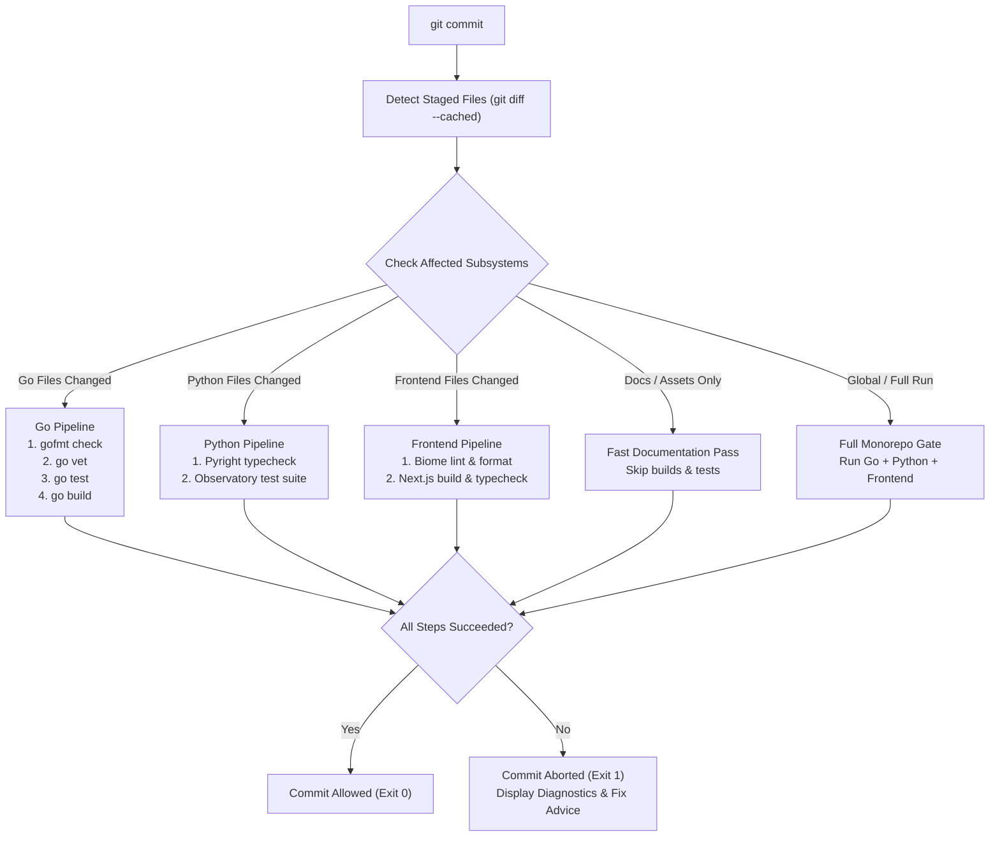

# Intelligent Git Pre-Commit Workflow

This document details the architecture, configuration, operation, and troubleshooting of the production-ready Git pre-commit workflow for the **GitHub Backup Automation System** monorepo.

---

## 1. Architecture Overview

The repository is a polyglot monorepo containing three core services:
1. **Go Backend & Worker CLI**: Go 1.25+ / 1.26 module (`github.com/MishraShardendu22/github-backup`) powering the backup worker and Fiber REST/WebSocket server.
2. **Python Agentic Observatory**: FastAPI + LangChain Tool-Calling RAG application managed with `uv` under `agentic-observatory/`.
3. **Next.js Frontend**: Next.js 16 (App Router, Turbopack, React 19, Biome, Tailwind CSS v4) under `frontend/`.



---

## 2. Why Native Tracked Git Hooks (`.githooks/`)?

Rather than imposing heavyweight JavaScript wrappers (Husky) or third-party binary managers (Lefthook) on a polyglot codebase, the repository uses tracked native Git hooks located in `.githooks/`:

* **Zero External Dependencies**: Reuses the repository's native toolchains (`go`, `uv`, `pnpm`, `bash`).
* **Cross-Platform Compatibility**: Executes reliably on Linux, macOS, Windows Git Bash, and WSL.
* **Version Controlled**: `.githooks/pre-commit` is tracked in Git, ensuring all team members share identical pre-commit validation rules.
* **Fail-Fast & Dependency-Ordered**: Validations run in order of execution speed and dependency hierarchy (Formatting $\rightarrow$ Static Analysis $\rightarrow$ Tests $\rightarrow$ Builds).

---

## 3. Validation Matrix

The pre-commit hook automatically executes the following suite of validations:

| Subsystem | Stage | Validation Command | Remediation Command |
| :--- | :--- | :--- | :--- |
| **Go** | 1. Code Formatting | `gofmt -l <staged_files>` | `make format` or `gofmt -w <file>` |
| **Go** | 2. Static Analysis | `go vet ./...` | Fix compiler warnings in Go code |
| **Go** | 3. Test Suite | `go test -v ./...` | `make test-go` |
| **Go** | 4. Artifact Build | `go build -v ./...` | Check Go syntax / package imports |
| **Python** | 1. Static Typecheck | `cd agentic-observatory && uv run --with pyright pyright` | `make typecheck` |
| **Python** | 2. Test Suite | `cd agentic-observatory && uv run python test_*.py` | `make test-py` / `make test-agents` |
| **Frontend** | 1. Lint & Format | `cd frontend && pnpm run lint` (`biome check`) | `make format` / `pnpm run format` |
| **Frontend** | 2. Turbopack Build | `cd frontend && pnpm run build` | `cd frontend && pnpm run build` |

---

## 4. Installation & Activation

To activate the pre-commit hook in your local clone or worktree:

```bash
# Recommended: Using Makefile
make hooks-install

# Or directly via installer script:
./scripts/install-hooks.sh

# Or manually configure Git:
git config core.hooksPath .githooks
chmod +x .githooks/*
```

---

## 5. Selective vs Full Validation

The pre-commit workflow optimizes developer feedback loops by detecting staged files:

1. **Targeted Subsystem Execution**:
   * Staging only Go files runs only the Go formatting, vet, test, and build steps (~1–2s).
   * Staging only Python files runs only Pyright typecheck and the Observatory test suite (~3–4s).
   * Staging only Frontend files runs only Biome lint and Next.js build (~10–14s).
2. **Documentation Fast Path**:
   * Staging only documentation files (`*.md`, `*.txt`, `*.png`, `.gitignore`) bypasses heavy test and build execution (<0.2s).
3. **Full Monorepo Validation**:
   * Modifying global configuration (`Makefile`, `.github/`, `scripts/`, `.githooks/`) or running manual checks triggers the full multi-service suite.

---

## 6. Developer CLI Commands

The [`Makefile`](file:///home/ms22/Coding_stuff/Personal-Projects/github-backup-automation-system/Makefile) provides unified developer shortcuts:

```bash
# Run full pre-commit gate manually at any time
make pre-commit

# Auto-format all Go and Frontend source code
make format

# Run Pyright (Python) and TypeScript compiler checks
make typecheck

# Run all linters (Biome, Go vet, Pyright)
make lint

# Run all unit and AI agent test suites
make test
```

---

## 7. Environment Variables & Bypass Overrides

In specific development scenarios (e.g. drafting intermediate commits or quick emergency docs), the hook supports explicit environment overrides:

* **Bypass Test Suites**:
  ```bash
  SKIP_TESTS=1 git commit -m "chore: quick update"
  ```
* **Bypass Build Compilation**:
  ```bash
  SKIP_BUILDS=1 git commit -m "refactor: type adjustment"
  ```
* **Force Full Monorepo Validation**:
  ```bash
  PRECOMMIT_ALL=1 git commit -m "feat: monorepo change"
  ```
* **Complete Git Bypass (Native Git)**:
  ```bash
  git commit --no-verify -m "wip: draft checkpoint"
  ```

---

## 8. Continuous Integration Alignment

The pre-commit validation rules mirror the repository's GitHub Actions CI workflow in [`.github/workflows/ci.yml`](file:///home/ms22/Coding_stuff/Personal-Projects/github-backup-automation-system/.github/workflows/ci.yml). Any commit that passes the local pre-commit hook is guaranteed to pass the remote CI pipeline.
